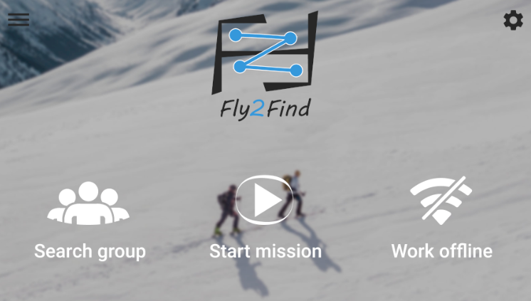
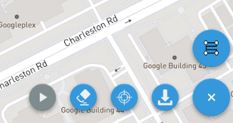

# Fly2Find

## Description:

The goal of our application is to be able for a user to join a search group as either a rescuer or an operator to find and rescue people in avalanches using a drone. We worked along with the LYF startup at EPFL which builds drones.

The application works as follows: Once you are in a search group, the operators can select a zone on the map and the drone will choose an optimized path in this area to collect signal strengths from the potential victim. Once the drone gets the first signal, it starts drawing a live heatmap on the map that can be seen from both the operators and the rescuers. Any member of the group can then place a special marker on the map on the potential location of the victim.

The organization of the group went as follows:

We had a [scrum board](https://github.com/Ph0tonic/SDP_Projet/projects/1) were we would write issues of the app or potential features to be added and each week we would assign our self to tasks to have an estimated working time of 8 hours per week. Once a task would be assigned, it would be moved in the `Sprint tasks` meaning that somebody is working on it and once the task would be completed and merged on the master branch, it would be moved in the `Done` column of the corresponding week. We had in total 13 weeks to complete our app. We also had one or two more meetings per week to each discuss about our progression and potential roadblocks.
Once a team member had finished his task, he had to create a pull request so that other team members could see what he did and accept his merge request or ask for changes.

Since the development of our app was part of a course at EPFL, we had to meet some requirements that were:

### Correctness & Utility:
Our app has many user-friendly features implemented as well as a nice UI to easily understand how to use the app.

### Split app model: 
We used Google Firebase to create the searching teams and each team has its own members stored in the firebase, once the heatmap is created, it is also stored in the firebase.

### Sensor usage:
Once you first open the app, it asks you if you allow it to use your location service. If you do so, the app locates you and puts a pinpoint of your location on the map. It also uses the sensor of the drone to locate it and to get the signal strength of the victim.

### User support:
We used the built-in Google authentication so that the user has to connect to a google account to be able to join a search group.

### Local cache:
The app stores the preferences of the users that can be changes in the settings such as the default altitude of the drone or the default language of the app.
It also stores the last map attributes such as the zoom or the position.

### Offline mode: 
We can download parts of the map so that it stays on the phone, and we can use them while being offline.

### Testing:
We tested most of our methods and have a current code coverage of 

## Working without a drone
To be  able to use our application without having a drone, the user must download a simulator as well as other useful tools, all of it is explained in our [wiki](https://github.com/Ph0tonic/SDP_Projet/wiki)

## Features:
* Connect through google sign-in
* Join/Create/Edit search groups from the application
* Modify settings which are then cached
* Open a map with useful widgets used for the mission building such as launching the mission, removing all the waypoints or downloading the current map.

    
* Change the current mission strategy, to either a circle or a quadrilateral

    
* The language of the app changes with the language of the user's phone
* Show the live camera of the drone (Unfortunately, it doesn't work well with the simulator)
* Build a live heatmap of the signals received by the drone
  
## License
Since our app is meant to be used, we decided to license it with the [GNU Affero General Public License v3.0](https://github.com/Ph0tonic/SDP_Projet/blob/master/LICENSE)